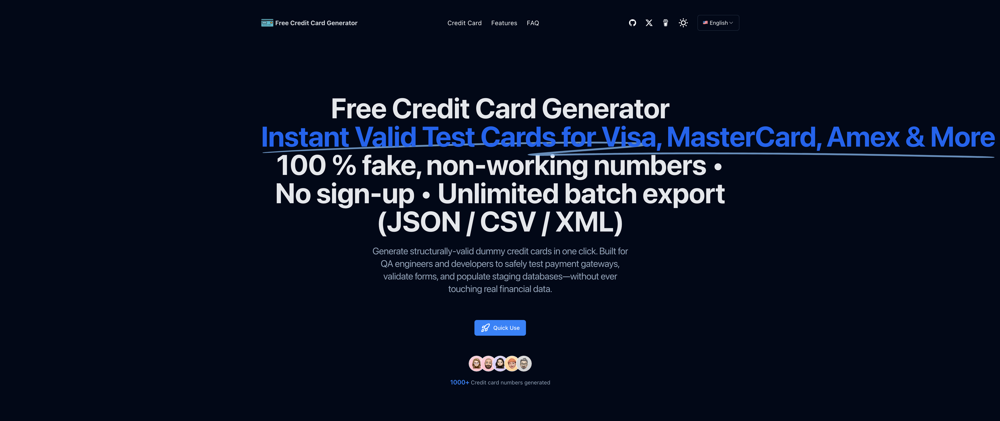

# 免费信用卡生成器与测试卡号 — 支持 Visa、Mastercard、Amex 等

[English](../README.md) | [简体中文](../README-zh.md)

一款面向开发者、QA 工程师和学生的免费浏览器端**虚拟信用卡生成器（fake credit card generator）与支付测试卡查询工具**。你可以生成用于表单测试的虚拟信用卡数据，将测试数据集导出为 JSON、CSV 或 XML，并查询适用于 Stripe、PayPal、Braintree 和 Mastercard Sandbox 测试环境的测试卡号。

**在线使用：** [creditcardgenerator.wangdu.site](https://creditcardgenerator.wangdu.site/zh)

> **仅限测试：** 生成的号码和公开测试卡没有任何资金价值，不能用于真实购物、支付、账户验证或身份验证。切勿在测试环境中输入真实持卡人数据。

[](https://creditcardgenerator.wangdu.site/zh)

## 按测试需求选择功能

| 如果你需要…… | 使用此功能 |
| --- | --- |
| 填充结账表单或预发布数据库 | 批量生成 1–1,000 条包含姓名、有效期和 CVV/CVC 的虚拟卡数据 |
| 测试成功的 Stripe 卡支付 | 查询 Stripe 测试卡集合 |
| 模拟 PayPal Sandbox 拒付和处理器响应 | 使用 PayPal 测试卡及触发值 |
| 测试 Braintree 对不同卡组织的处理 | 使用内置的 Braintree 测试卡示例 |
| 测试 Mastercard Sandbox 或 MTF 集成 | 查询覆盖 19 个国家和地区的 168 条 Mastercard 记录 |
| 将测试数据导入开发工具 | 将生成的数据集导出为 JSON、CSV 或 XML |

## 功能特性

- **批量生成虚拟卡：** 每批可创建 1 到 1,000 条记录。
- **支持九种卡组织：** Visa、Mastercard、American Express、Discover、JCB、RuPay、China UnionPay、Diners Club International 和 Maestro。
- **完整模拟数据：** 每条生成记录均包含卡号、示例持卡人姓名、未来有效期、CVV/CVC 和卡组织。
- **一键复制与导出：** 可复制单项数据，或下载 JSON、CSV 和 XML 文件。
- **支付服务商测试卡：** 集中查询 Stripe、PayPal、Braintree 和 Mastercard 测试数据，无需在多个文档网站之间来回查找。
- **PayPal Sandbox 触发器：** 测试拒付、欺诈、验证失败及处理器响应等场景。
- **Mastercard 测试卡目录：** 按国家和地区查看消费者卡与商业卡，并查询不同资金可用时间的测试场景。
- **响应式与多语言：** 支持桌面端和移动端，并提供英语、中文、日语、西班牙语、俄语和阿拉伯语界面。
- **无需注册账户：** 打开网站即可生成测试数据。

## 随机生成的虚拟卡与服务商测试卡有什么区别？

这两类数据适用于不同的测试目标：

| 数据类型 | 适用场景 | 重要限制 |
| --- | --- | --- |
| 随机生成的虚拟卡 | UI 开发、输入格式验证、模拟数据、演示、数据库结构和导出流程 | 这些是按格式随机生成的数据，不能保证触发特定的支付网关响应 |
| 服务商发布的测试卡 | Stripe 测试模式、PayPal Sandbox、Braintree 测试及 Mastercard Sandbox/MTF 集成 | 仅适用于服务商支持的测试环境，无法完成真实交易 |

进行支付网关联调时，请始终使用相应服务商发布的测试卡号，并遵循该服务商对有效期、CVV/CVC、测试账户和运行环境的要求。

## 可查询的支付测试卡

### Stripe 测试卡

Stripe 区域收录了适用于主流卡组织和不同地区场景的成功支付测试卡。每条记录均展示卡号、CVC 规则、有效期规则、测试场景和复制按钮。

来源：[Stripe 测试文档](https://docs.stripe.com/testing)

### PayPal Sandbox 测试卡与触发器

使用 PayPal 区域测试 Sandbox 卡支付流程和处理器响应。触发值覆盖拒付、疑似欺诈、验证失败、无效账户和重试指引等情况。

来源：[PayPal Sandbox 卡测试文档](https://developer.paypal.com/tools/sandbox/card-testing/)

### Braintree 测试卡

Braintree 区域提供 Visa、Discover、JCB 和 Maestro 的测试示例。请仅在 Braintree 测试环境中使用这些卡号。

### Mastercard 测试卡

Mastercard 测试卡目录包含：

- 19 个国家和地区分组；
- 168 条来源记录，包括官方来源中重复出现的越南商业卡记录；
- 分开显示的消费者卡和商业卡列表；
- 立即可用、下一个工作日可用及 2–5 个工作日可用的资金场景；
- 适用于 Sandbox 和 MTF 测试的纯数字卡号复制功能。

Mastercard 官方来源没有为这些记录提供有效期或 CVV，因此本项目不会虚构这些字段。

来源：[Mastercard Developers 测试卡号](https://developer.mastercard.com/mastercard-merchant-presented-qr/documentation/server-apis/test-card-numbers/)

## 如何生成测试信用卡数据

1. 打开[免费信用卡生成器](https://creditcardgenerator.wangdu.site/zh)。
2. 选择卡组织。
3. 设置 1 到 1,000 的生成数量。
4. 点击**生成**。
5. 复制单项数据，或将整批数据导出为 JSON、CSV 或 XML。

生成的数据适合用于原型、表单验证、自动化测试夹具和预发布数据库。当你需要支付处理器返回文档中规定的 Sandbox 结果时，请使用页面中的服务商测试卡区域。

## 支持的语言

- [English](https://creditcardgenerator.wangdu.site/)
- [简体中文](https://creditcardgenerator.wangdu.site/zh)
- [日本語](https://creditcardgenerator.wangdu.site/ja)
- [Español](https://creditcardgenerator.wangdu.site/es)
- [Русский](https://creditcardgenerator.wangdu.site/ru)
- [العربية](https://creditcardgenerator.wangdu.site/ar)

## 本地开发

### 环境要求

- Node.js 18 或更高版本
- npm

### 安装与运行

```bash
git clone https://github.com/dongyubin/Credit-Card-Generator.git
cd Credit-Card-Generator
npm ci
npm run dev
```

在浏览器中打开 [http://localhost:3000](http://localhost:3000)。

### 生产构建

```bash
npm run build
npm run start
```

### 工程验证

```bash
node --test config/mastercardTestCards.test.mjs
npx tsc --noEmit
npm run lint
npm run build
```

## 技术栈

- [Next.js 14](https://nextjs.org/)
- [React 18](https://react.dev/)
- [TypeScript](https://www.typescriptlang.org/)
- [Tailwind CSS](https://tailwindcss.com/)
- [Radix UI](https://www.radix-ui.com/)
- [Framer Motion](https://www.framer.com/motion/)

## 项目结构

```text
app/                         Next.js 路由与布局
components/home/             生成器和服务商测试卡界面
config/                      网站内容与测试卡数据集
config/mastercardTestCards.ts
locales/                     英语、中文、日语、西班牙语、俄语和阿拉伯语文案
public/                      图片、图标、robots.txt 和 sitemap 输出
```

## 常见问题

### 这是真实的信用卡生成器吗？

不是。本工具生成的是用于软件测试和演示的虚拟数据，不会创建银行账户、信用额度、资金或能够完成真实交易的信用卡。

### 生成的号码可以用于 Stripe 或 PayPal 吗？

请使用网站中专门提供的 Stripe 或 PayPal 测试卡。随机生成的数据适合 UI 和数据测试，但不能保证被支付服务商的 Sandbox 接受。

### 公开这些测试卡号安全吗？

服务商测试卡号是面向测试环境公开发布的数据，与真实持卡人无关。请勿将它们与真实个人信息或金融数据结合使用。

### 生成器会把卡片数据发送给支付处理器吗？

不会。生成器在浏览器中创建并导出模拟卡片记录。支付服务商测试卡仅作为参考数据展示，本项目不会代替你提交交易。

### 本项目提供信用卡生成器 API 吗？

目前不提供公共 API。Web 界面支持在浏览器中生成、复制以及下载 JSON、CSV 和 XML 文件。

## 参与贡献

欢迎提交错误报告、文档修正、翻译改进，以及有可靠来源的测试卡更新。

1. Fork 本仓库。
2. 创建功能分支。
3. 完成修改并进行验证。
4. 创建 Pull Request，并说明数据来源和测试情况。

更新服务商测试卡时，请保留原始顺序并记录官方来源。切勿添加真实支付卡数据。

## 负责任地使用

本项目仅用于软件开发、QA、教育和 Sandbox 测试。你有责任遵守适用法律、支付服务商条款和安全要求。维护者不支持欺诈、未经授权的交易、盗刷、身份盗窃或绕过支付控制的行为。
